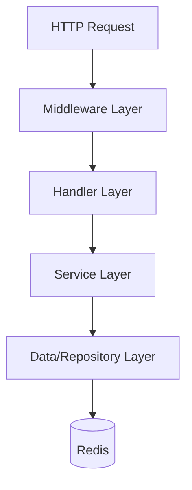

# GuessWhoService — Complete Code Walkthrough

This document provides a comprehensive technical walkthrough of the **GuessWhoService** codebase. It is intended for developers who need to understand the architecture, data flow, and implementation details of the service.

---

## 1. Service Overview

**GuessWhoService** is a Go-based HTTP API that powers the *"Guess Who: Identity Under Fire"* hackathon challenge.

### Core Functionality
- **Game Logic**: Manages game sessions where players identify a hidden target from a board of 64 candidates.
- **State Management**: Persists game state (sessions, scores, leaderboards) in Redis.
- **Resilience Testing**: Features built-in "chaos" modes (flaky endpoints, delays) to test client resilience.
- **Security**: Implements JWT-based team authentication and Google OIDC for service-to-service auth.

### Tech Stack
- **Language**: Go 1.24
- **Database**: Redis (using `go-redis/v8`)
- **Runtime**: Google Cloud Run (Docker containerized)
- **Routing**: Standard library `http.ServeMux` (Go 1.22+ patterns)

---

## 2. High-Level Architecture

The service follows a clean, layered architecture:



- **Middleware Layer**: Handles cross-cutting concerns like logging, recovery, CORS, authentication, and rate limiting.
- **Handler Layer**: Parses HTTP requests, validates input, calls services, and formats JSON responses.
- **Service Layer**: Contains the core business logic (rules, scoring, board generation).
- **Data Layer**: Manages data persistence and retrieval from Redis and static files.

---

## 3. Project Structure

```
guesswhoservice/
├── guesswhoserviceapi.go          # Application Entry Point
├── Dockerfile                      # Container definition
├── go.mod                          # Module dependencies
├── config/
│   └── config.go                   # Configuration loader
├── data/
│   └── characters.json             # Static character data definitions
├── docs/                           # Documentation
├── internal/
│   ├── domain/                     # Domain models (Entities)
│   ├── db/                         # Data access (Redis)
│   ├── service/                    # Business logic interfaces & implementations
│   ├── handler/                    # HTTP handlers
│   └── middleware/                 # HTTP middleware
```

---

## 4. Key Components Walkthrough

### 4.1 Application Entry Point (`guesswhoserviceapi.go`)

This file bootstraps the application. It performs the following sequence:

1.  **Config Loading**: Reads environment variables via `config.Load()`.
2.  **Redis Connection**: Establishes and verifies connection to Redis.
3.  **Dependency Injection**: Initializes all repositories, services, and handlers.
4.  **Data Initialization**: Loads `characters.json` and initializes the "Masterboard" in Redis.
5.  **Router Setup**: Configures routes using Go 1.22's enhanced `http.ServeMux`.
6.  **Server Start**: Launches the HTTP server on port 8080 (or configured port).

### 4.2 Configuration (`config/config.go`)

Configuration is managed via the `Config` struct, loaded from environment variables:
- `PORT`: Service port.
- `REDIS_ADDR`: Redis connection string.
- `CHAOS_ENABLED`: Toggles failure injection features.
- `JWT_SECRET`: Secret key for signing team tokens.

### 4.3 Domain Models (`internal/domain/`)

These are pure Go structs representing the core business entities.

-   **`Candidate`** (`candidate.go`): Represents a person on the board with traits.
-   **`Session`** (`session.go`): The central game state, including the generated board, target candidate, questions asked, and chaos profile.
-   **`TraitDefinition`** (`trait.go`): Defines a question that can be asked (e.g., "Hair color?").
-   **`ScoreBreakdown`** (`score.go`): Detailed scoring components (base, time bonus, penalties).

### 4.4 Data Layer (`internal/db/redis_store.go`)

The `Store` struct encapsulates all Redis interactions. Key features include:

-   **Atomic Updates**: Uses Lua scripts (`updateTeamStatsScript`) to update scores, leaderboards, and solved sets atomically to prevent race conditions.
-   **Pipelines**: extensively uses Redis pipelines (e.g., in `GetLeaderboardEntries`) to reduce network round-trips (N+1 problem).
-   **Session Storage**: Serializes `Session` objects to JSON for storage.
-   **Leaderboards**: Uses Redis Sorted Sets (`ZSET`) for efficient leaderboard ranking.

### 4.5 Service Layer (`internal/service/`)

This layer contains the "brains" of the operation.

-   **`SessionService`** (`session_service.go`):
    -   Orchestrates the game flow (Start, Ask, Guess, Reveal).
    -   Manages the lifecycle of a game session.
    -   Enforces game rules (guess limits, valid questions).
-   **`BoardGeneratorService`** (`board_generator.go`):
    -   Deterministically generates a board of unique candidates based on a seed.
    -   Ensures sessions are reproducible if needed.
-   **`ChaosService`** (`chaos.go`):
    -   Injects artificial failures (delays, errors) based on the configured `ChaosProfile` to test client resilience.
-   **`ScoringService`** (`scoring.go`):
    -   Calculates scores based on time taken, questions asked, and reliability (penalties for failed requests).
-   **`EncryptionService`** (`encryption.go`):
    -   Handles base64 encoding/decoding for "encrypted" trait answers.
    -   Hashes team passwords using bcrypt.

### 4.6 Handler Layer (`internal/handler/`)

-   **`SessionHandler`**: Endpoints for gameplay (`/sessions/start`, `/ask`, `/guess`).
-   **`TraitHandler`**: Endpoints for static data (`/questions`) and utilities (`/decode`).
-   **`ClientHandler`**: Endpoints for team management (`/signup`, `/login`) and global state (`/leaderboard`).

### 4.7 Middleware (`internal/middleware/`)

-   **`AuthMiddleware`**:
    -   `JWTAuth`: Validates team tokens for protected endpoints.
    -   `OIDCAuth`: Validates Google ID tokens for service-to-service calls.
-   **`RateLimiter`**:
    -   Implements a token bucket algorithm to rate-limit requests per team, preventing brute-forcing.

---

## 5. Key Workflows

### 5.1 Starting a Session
1.  **Request**: `POST /sessions/start` with team ID.
2.  **Service**:
    -   Generates a stable seed.
    -   Creates a board of 64 candidates.
    -   Filters out characters the team has already solved.
    -   Selects a random `TargetCandidate`.
    -   Saves the session to Redis.
3.  **Response**: Returns `sessionId`, `boardSize`, and `chaosProfile`.

### 5.2 Asking a Question
1.  **Request**: `POST /sessions/{id}/ask` with `questionId`.
2.  **Service**:
    -   Loads session from Redis.
    -   **Chaos Check**: `ChaosService` determines if the request should artificially fail/degrade.
    -   Retrieves the answer from the `TargetCandidate`.
    -   **Encryption**: If the trait is "sensitive", encrypts the answer.
    -   Records the question in the session.
3.  **Response**: Returns the answer (plaintext or encrypted).

### 5.3 Submitting a Guess
1.  **Request**: `POST /sessions/{id}/guess` with `candidateId`.
2.  **Service**:
    -   Checks if the guess matches the `TargetCandidate`.
    -   **Correct**:
        -   Calculates score.
        -   Atomically updates team stats (Redis Lua script).
        -   Marks session as complete.
    -   **Incorrect**:
        -   Applies penalty.
        -   Decrements remaining guesses.
3.  **Response**: Returns `correct` (bool), `score`, and session status.

### 5.4 Scoring & Persistence Details

The score calculation and Redis updates happen specifically within `SessionService.SubmitGuess` (`internal/service/session_service.go`).

#### A. Score Calculation (`ScoringService.CalculateScore`)
The final score for a **correct guess** is calculated as:
```go
Total = Base + TimeBonus + QuestionBonus - ReliabilityPenalty
```
-   **Base**: 1000 points.
-   **Time Bonus**: `600 - seconds_elapsed` (min 0).
-   **Question Bonus**: `300 - (20 * questions_asked)` (min 0).
-   **Reliability Penalty**: `(5 * failed_requests) + (2 * timeouts) + (10 * 5xx_errors)`.

An **incorrect guess** incurs a fixed penalty of **-200 points**.

#### B. Redis Persistence
The service uses two distinct methods to update Redis, depending on the outcome:

1.  **On Correct Guess** (`dbStore.UpdateTeamStatsAtomic`):
    -   Uses a **Lua script** to ensure atomicity across multiple keys.
    -   **Updates**:
        -   Increments `team:{id}` score by total calculated points.
        -   Increments `team:{id}` solve count.
        -   Adds character ID to `team:{id}:solved_characters`.
        -   Updates `leaderboard` ZSET with new total score.
        -   Adds team ID to `masterboard:{charID}` set.

2.  **On Incorrect Guess** (`dbStore.IncrementTeamScore`):
    -   Uses a **Redis Pipeline**.
    -   **Updates**:
        -   Decrements `team:{id}` score by 200.
        -   Decrements `leaderboard` score by 200.

---

## 6. Data Models

### Redis Key Schema

| Key Pattern | Type | Purpose |
|---|---|---|
| `team:{teamID}` | Hash | Team profile (score, solves, etc.) |
| `team:{teamID}:solved_characters` | Set | IDs of characters solved by this team |
| `session:{sessionID}` | String | JSON serialized session data |
| `leaderboard` | ZSet | Sorted set for team rankings |
| `masterboard:{charID}` | Set | IDs of teams who solved this character |
| `game_updates` | PubSub | Channel for real-time updates |

---

## 7. How to Run

### Local Development
```bash
# Install dependencies
go mod download

# Run the service
go run guesswhoserviceapi.go
```

### Docker
```bash
# Build
docker build -t guesswhoservice .

# Run
docker run -p 8080:8080 -e PORT=8080 guesswhoservice