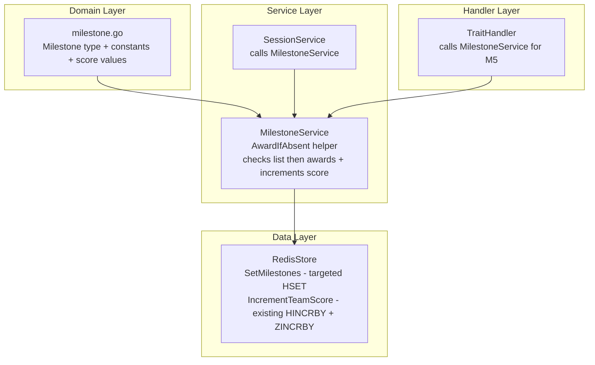
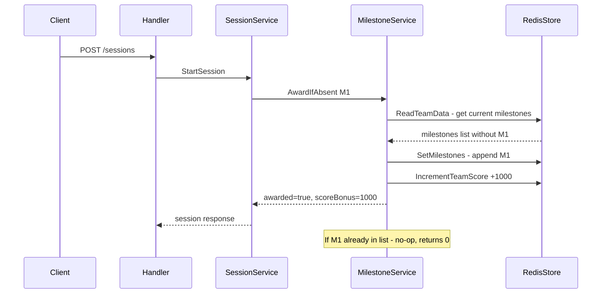
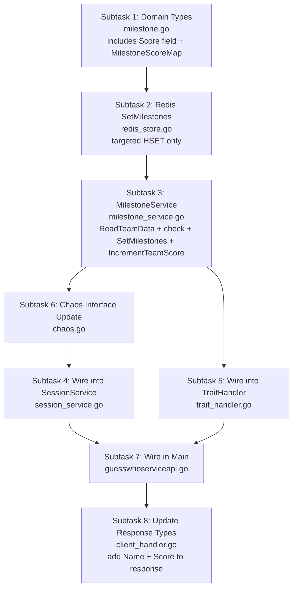

# Milestone Implementation Plan

## 1. Overview

This document details the implementation plan for adding **milestone tracking** to the Guess Who service. Milestones are one-time achievements awarded to teams as they reach specific progress points during gameplay. Each milestone can only be achieved **once per team** — subsequent triggers are no-ops.

**Key requirement**: Milestones also award **score bonuses** to the team:
- **Core Milestone (M1–M5)**: **+1000 points**
- **Stretch Milestone (S1–S3)**: **+2000 points**

## 2. Milestone Definitions

### 2.1 Core Milestones (+1000 points each)

| ID | Name | Description | Trigger Condition |
|----|------|-------------|-------------------|
| **M1** | First Round Started | Team has started their first game session | `StartSession()` is called and team has no existing M1 |
| **M2** | First Successful Question | Team received their first non-degraded answer | `AskQuestion()` returns a successful response and team has no existing M2 |
| **M3** | Elimination Working | Team is using elimination logic to narrow candidates | `AskQuestion()` — team has asked ≥ 3 questions in a single session |
| **M4** | First Correct Solve | Team correctly identified a character | `SubmitGuess()` returns `correct: true` for the first time |
| **M5** | Encrypted Answer Handled | Team successfully decoded an encrypted trait answer | `Decode()` handler is called successfully and team has no existing M5 |

### 2.2 Stretch Milestones (+2000 points each)

| ID | Name | Description | Trigger Condition |
|----|------|-------------|-------------------|
| **S1** | Efficiency | Solved a character with minimal questions | `SubmitGuess()` returns correct with ≤ 10 questions asked in the session |
| **S2** | Automation | Demonstrating automated/rapid solving | Team has ≥ 3 total correct solves |
| **S3** | Resilience | Successfully handled flaky/chaotic responses | `AskQuestion()` returns a successful answer for a flaky trait during an active chaos window |

### 2.3 Score Summary

| Type | Count | Points Each | Max Total |
|------|-------|-------------|-----------|
| Core (M1–M5) | 5 | 1,000 | 5,000 |
| Stretch (S1–S3) | 3 | 2,000 | 6,000 |
| **Grand Total** | **8** | | **11,000** |

## 3. Architecture

### 3.1 Design Principles

- **Idempotent**: Each milestone is awarded at most once per team. The `MilestoneService` checks the current milestones list before awarding.
- **Simple**: No new Lua scripts. Uses existing `TeamData.Milestones` field and existing `IncrementTeamScore()` for score updates.
- **Non-blocking**: Milestone evaluation failures are logged but never block the main game flow.
- **Single Responsibility**: A dedicated `MilestoneService` with helper functions encapsulates all milestone logic.

### 3.2 Approach — Using Existing Infrastructure

Instead of a dedicated Lua script, the milestone system uses the existing infrastructure:

1. **`TeamData.Milestones []string`** — already stored as a comma-separated string in the team Redis hash
2. **`ReadTeamData()`** — reads milestones along with all other team data
3. **`IncrementTeamScore()`** — already does `HINCRBY` on team hash + `ZINCRBY` on leaderboard in a pipeline
4. **A new `SetMilestones()` store method** — targeted `HSET` on just the milestones field (like `SetActiveSession`)

The `MilestoneService.AwardIfAbsent()` method:
1. Reads current milestones from Redis via `ReadTeamData()` (or receives them as a parameter)
2. Checks if the milestone already exists in the list
3. If not present: appends it, calls `SetMilestones()` to persist, and calls `IncrementTeamScore()` with the bonus
4. Returns the score bonus if newly awarded (0 if already existed)

### 3.3 Component Diagram



### 3.4 Flow Diagram



## 4. Implementation Subtasks

### Subtask 1: Create Domain Type — `internal/domain/milestone.go`

**New file.** Define the `Milestone` custom string type, all milestone constants, and **score values**.

```go
package domain

// Milestone is a type-safe identifier for team achievements.
type Milestone string

const (
    MilestoneM1 Milestone = "M1" // First Round Started
    MilestoneM2 Milestone = "M2" // First Successful Question
    MilestoneM3 Milestone = "M3" // Elimination Working
    MilestoneM4 Milestone = "M4" // First Correct Solve
    MilestoneM5 Milestone = "M5" // Encrypted Answer Handled
    MilestoneS1 Milestone = "S1" // Efficiency
    MilestoneS2 Milestone = "S2" // Automation
    MilestoneS3 Milestone = "S3" // Resilience
)

// Milestone score bonuses
const (
    CoreMilestoneScore    = 1000 // Points awarded for M1-M5
    StretchMilestoneScore = 2000 // Points awarded for S1-S3
)

// MilestoneInfo provides human-readable metadata for a milestone.
type MilestoneInfo struct {
    ID          Milestone
    Name        string
    Description string
    Score       int
}

// AllMilestones is the complete ordered list of milestones.
var AllMilestones = []MilestoneInfo{
    {MilestoneM1, "First Round Started", "Started your first game session", CoreMilestoneScore},
    {MilestoneM2, "First Successful Question", "Received your first non-degraded answer", CoreMilestoneScore},
    {MilestoneM3, "Elimination Working", "Asked 3+ questions in a single session", CoreMilestoneScore},
    {MilestoneM4, "First Correct Solve", "Correctly identified a character", CoreMilestoneScore},
    {MilestoneM5, "Encrypted Answer Handled", "Successfully decoded an encrypted answer", CoreMilestoneScore},
    {MilestoneS1, "Efficiency", "Solved with 10 or fewer questions", StretchMilestoneScore},
    {MilestoneS2, "Automation", "Achieved 3+ total correct solves", StretchMilestoneScore},
    {MilestoneS3, "Resilience", "Got a valid answer from a flaky trait during chaos", StretchMilestoneScore},
}

// MilestoneScoreMap provides a quick lookup from milestone ID to its score value.
var MilestoneScoreMap = func() map[Milestone]int {
    m := make(map[Milestone]int, len(AllMilestones))
    for _, mi := range AllMilestones {
        m[mi.ID] = mi.Score
    }
    return m
}()
```

**Files changed:** New file `internal/domain/milestone.go`

---

### Subtask 2: Add `SetMilestones` to Redis Store — `internal/db/redis_store.go`

**Modify existing file.** Add a targeted `HSET` method for the milestones field only (similar to existing `SetActiveSession`). No Lua scripts needed.

```go
// SetMilestones updates only the milestones field in the team hash.
// This is a targeted HSET that does not touch any other team fields.
func (s *Store) SetMilestones(ctx context.Context, teamID string, milestones []string) error {
    return s.client.HSet(ctx, "team:"+teamID, "milestones", strings.Join(milestones, ",")).Err()
}
```

Note: The existing `IncrementTeamScore()` method already handles score + leaderboard updates and will be reused as-is.

**Files changed:** `internal/db/redis_store.go` — add `SetMilestones()`

---

### Subtask 3: Create MilestoneService — `internal/service/milestone_service.go`

**New file.** The service contains helper functions to check milestones and award them with score bonuses.

```go
package service

import (
    "context"
    "log"

    "github.com/guesswho/internal/db"
    "github.com/guesswho/internal/domain"
)

// MilestoneService handles milestone checking and awarding.
type MilestoneService interface {
    // AwardIfAbsent checks if a team already has the given milestone.
    // If not, it adds the milestone to the team's list, increments the team's
    // score by the milestone's bonus, and returns true.
    // If already present, returns false. Errors are logged but not propagated.
    AwardIfAbsent(ctx context.Context, teamID string, milestone domain.Milestone) bool
}

type milestoneService struct {
    store *db.Store
}

func NewMilestoneService(store *db.Store) MilestoneService {
    return &milestoneService{store: store}
}

func (m *milestoneService) AwardIfAbsent(ctx context.Context, teamID string, milestone domain.Milestone) bool {
    // Look up the score bonus for this milestone
    scoreBonus, ok := domain.MilestoneScoreMap[milestone]
    if !ok {
        log.Printf("[milestone] Unknown milestone %s for team %s", milestone, teamID)
        return false
    }

    // Read current team data to check existing milestones
    teamData, err := m.store.ReadTeamData(ctx, teamID)
    if err != nil {
        log.Printf("[milestone] Error reading team data for %s: %v", teamID, err)
        return false
    }

    // Check if milestone already exists
    milestoneStr := string(milestone)
    for _, existing := range teamData.Milestones {
        if existing == milestoneStr {
            return false // Already awarded
        }
    }

    // Append milestone and persist
    updatedMilestones := append(teamData.Milestones, milestoneStr)
    if err := m.store.SetMilestones(ctx, teamID, updatedMilestones); err != nil {
        log.Printf("[milestone] Error setting milestones for team %s: %v", teamID, err)
        return false
    }

    // Increment score using existing method (HINCRBY + ZINCRBY leaderboard)
    if err := m.store.IncrementTeamScore(ctx, teamID, scoreBonus); err != nil {
        log.Printf("[milestone] Error incrementing score for team %s: %v", teamID, err)
        // Milestone was already persisted, score increment failed — log but don't undo
        return true
    }

    log.Printf("[milestone] Awarded %s (+%d pts) to team %s", milestone, scoreBonus, teamID)
    return true
}
```

**Files changed:** New file `internal/service/milestone_service.go`

---

### Subtask 4: Wire MilestoneService into SessionService — `internal/service/session_service.go`

**Modify existing file.** Add `milestoneService` as a dependency and call it at the appropriate trigger points.

Changes to [`sessionService`](internal/service/session_service.go:27) struct:
- Add field: `milestoneService MilestoneService`

Changes to [`NewSessionService()`](internal/service/session_service.go:47):
- Add `milestoneService MilestoneService` parameter

Changes to [`StartSession()`](internal/service/session_service.go:82):
- After session is successfully created and persisted (after line 166), award **M1**:
  ```go
  s.milestoneService.AwardIfAbsent(context.Background(), teamID, domain.MilestoneM1)
  ```

Changes to [`AskQuestion()`](internal/service/session_service.go:175):
- After successful non-degraded answer (after line 231), award **M2**:
  ```go
  s.milestoneService.AwardIfAbsent(ctx, session.TeamID, domain.MilestoneM2)
  ```
- After recording question (after line 211), check if `len(session.QuestionsAsked) >= 3` and award **M3**:
  ```go
  if len(session.QuestionsAsked) >= 3 {
      s.milestoneService.AwardIfAbsent(ctx, session.TeamID, domain.MilestoneM3)
  }
  ```
- For **S3**: If `traitDef.IsFlaky` is true AND `chaosService.IsInChaosWindow(session)` is true AND the answer was successful (not degraded), award S3:
  ```go
  if traitDef.IsFlaky && s.chaosService.IsInChaosWindow(session) {
      s.milestoneService.AwardIfAbsent(ctx, session.TeamID, domain.MilestoneS3)
  }
  ```

Changes to [`SubmitGuess()`](internal/service/session_service.go:236):
- After correct guess is confirmed (inside the `if correct` block at line 279), award **M4**:
  
  ```go
  s.milestoneService.AwardIfAbsent(ctx, session.TeamID, domain.MilestoneM4)
  ```
- For **S1**: If correct AND `session.GetQuestionsAskedCount() <= 10`, award S1:
  ```go
  if session.GetQuestionsAskedCount() <= 10 {
      s.milestoneService.AwardIfAbsent(ctx, session.TeamID, domain.MilestoneS1)
  }
  ```
- For **S2**: After updating team stats (inside the `if session.Completed && correct` block), read updated team data and check if `solves >= 3`:
  ```go
  teamData, err := s.dbStore.ReadTeamData(ctx, session.TeamID)
  if err == nil && teamData.Solves >= 3 {
      s.milestoneService.AwardIfAbsent(ctx, session.TeamID, domain.MilestoneS2)
  }
  ```

**Files changed:** `internal/service/session_service.go`

---

### Subtask 5: Wire MilestoneService into TraitHandler for M5 — `internal/handler/trait_handler.go`

**Modify existing file.** Add `milestoneService` as a dependency to `TraitHandler` so the [`Decode()`](internal/handler/trait_handler.go:59) handler can award M5.

Changes to [`TraitHandler`](internal/handler/trait_handler.go:11) struct:
- Add field: `milestoneService service.MilestoneService`

Changes to [`NewTraitHandler()`](internal/handler/trait_handler.go:17):
- Add `milestoneService service.MilestoneService` parameter

Changes to [`Decode()`](internal/handler/trait_handler.go:59):
- After successful decryption (after line 70), extract `teamID` from the request context and award M5:
  ```go
  if teamID, ok := r.Context().Value(middleware.TeamIDKey).(string); ok {
      h.milestoneService.AwardIfAbsent(r.Context(), teamID, domain.MilestoneM5)
  }
  ```

**Files changed:** `internal/handler/trait_handler.go`

---

### Subtask 6: Expose ChaosWindow Check for S3 — `internal/service/chaos.go`

**Modify existing file.** Add a public method to check if a session is currently in a chaos window.

```go
// IsInChaosWindow returns true if the session is currently in a chaos window.
func (s *chaosService) IsInChaosWindow(session *domain.Session) bool {
    return s.isInChaosWindow(session)
}
```

Update the [`ChaosService`](internal/service/chaos.go:11) interface to include:
```go
IsInChaosWindow(session *domain.Session) bool
```

**Files changed:** `internal/service/chaos.go` — add `IsInChaosWindow()` to interface and implementation

---

### Subtask 7: Wire MilestoneService in Main Entry Point — `guesswhoserviceapi.go`

**Modify existing file.** Create the `MilestoneService` and inject it into `SessionService` and `TraitHandler`.

Changes to [`main()`](guesswhoserviceapi.go:67):
- After creating `scoringService` (line 113), create `milestoneService`:
  ```go
  milestoneService := service.NewMilestoneService(dbStore)
  ```
- Update `NewSessionService()` call (line 115-127) to include `milestoneService` as a parameter
- Update `NewTraitHandler()` call (line 131) to include `milestoneService` as a parameter:
  ```go
  traitHandler := handler.NewTraitHandler(traitCatalog, encryptionService, milestoneService)
  ```

**Files changed:** `guesswhoserviceapi.go`

---

### Subtask 8: Update Client Handler Response Types — `internal/handler/client_handler.go`

**Modify existing file.** Update [`CompletedMilestone`](internal/handler/client_handler.go:59) to include the milestone name and score.

Changes to [`CompletedMilestone`](internal/handler/client_handler.go:59):
```go
type CompletedMilestone struct {
    ID        string `json:"id"`
    Name      string `json:"name"`
    Score     int    `json:"score"`
    TimeTaken string `json:"timeTaken"`
}
```

Changes to [`GetTeamProgressHandler()`](internal/handler/client_handler.go:193):
- Build a lookup map from `domain.AllMilestones` to populate the `Name` and `Score` fields:
  ```go
  type milestoneMetadata struct {
      Name  string
      Score int
  }
  milestoneMeta := make(map[string]milestoneMetadata)
  for _, mi := range domain.AllMilestones {
      milestoneMeta[string(mi.ID)] = milestoneMetadata{Name: mi.Name, Score: mi.Score}
  }

  milestones := make([]CompletedMilestone, 0, len(team.Milestones))
  for _, m := range team.Milestones {
      if m != "" {
          meta := milestoneMeta[m]
          milestones = append(milestones, CompletedMilestone{
              ID:        m,
              Name:      meta.Name,
              Score:     meta.Score,
              TimeTaken: "",
          })
      }
  }
  ```

**Files changed:** `internal/handler/client_handler.go`

---

## 5. Execution Order



1. **Subtask 1** — Domain types with score values (no dependencies)
2. **Subtask 2** — Redis `SetMilestones` targeted HSET (no new Lua scripts)
3. **Subtask 3** — MilestoneService using existing `ReadTeamData` + `IncrementTeamScore` (depends on 1 + 2)
4. **Subtask 6** — Chaos interface (depends on nothing new, enables S3)
5. **Subtask 4** — Wire into SessionService (depends on 3 + 6)
6. **Subtask 5** — Wire into TraitHandler (depends on 3)
7. **Subtask 7** — Wire in main (depends on 4 + 5)
8. **Subtask 8** — Update response types (depends on 1)

## 6. Files Changed Summary

| File | Action | What Changes |
|------|--------|--------------|
| `internal/domain/milestone.go` | **New** | `Milestone` type, constants M1-S3, `MilestoneInfo` with `Score` field, `AllMilestones`, `MilestoneScoreMap`, score constants |
| `internal/db/redis_store.go` | **Modify** | Add `SetMilestones()` — targeted HSET for milestones field only |
| `internal/service/milestone_service.go` | **New** | `MilestoneService` interface + implementation using `ReadTeamData`, `SetMilestones`, `IncrementTeamScore` |
| `internal/service/session_service.go` | **Modify** | Add `milestoneService` field, award calls in `StartSession`, `AskQuestion`, `SubmitGuess` |
| `internal/handler/trait_handler.go` | **Modify** | Add `milestoneService` field, M5 award in `Decode()` |
| `internal/service/chaos.go` | **Modify** | Add `IsInChaosWindow()` to interface + implementation |
| `guesswhoserviceapi.go` | **Modify** | Create and inject `MilestoneService` |
| `internal/handler/client_handler.go` | **Modify** | Add `Name` + `Score` to `CompletedMilestone`, populate from `AllMilestones` |

## 7. Scoring Impact Analysis

### Before Milestones
- Score comes from: correct solve bonus (`Base + TimeBonus + QuestionBonus - ReliabilityPenalty`) and wrong guess penalties (-200 each)
- Typical correct solve: ~1000-1900 points
- Wrong guess: -200 points

### After Milestones
- All existing scoring is unchanged
- Milestone bonuses are additive and awarded exactly once
- Maximum milestone bonus: 11,000 points (5 x 1,000 + 3 x 2,000)
- Score increments use the existing `IncrementTeamScore()` pipeline (HINCRBY + ZINCRBY), so leaderboard stays consistent

### How Score is Applied
1. `MilestoneService.AwardIfAbsent()` reads current milestones via `ReadTeamData()`
2. Checks if milestone already exists in the list
3. If new: calls `SetMilestones()` to persist the updated list, then `IncrementTeamScore()` to add the bonus
4. If already present: no-op, returns false

## 8. Testing Considerations

- **Unit tests for `MilestoneService`**: Mock the store and verify:
  - `AwardIfAbsent` reads team data, checks milestones, calls `SetMilestones` + `IncrementTeamScore` with correct score
  - Second call for same milestone is a no-op (no score increment)
  - Core milestones award 1000, stretch milestones award 2000
- **Integration tests**: Start a session -> ask questions -> guess correctly -> verify milestones are in team data AND total score reflects bonuses
- **Edge case**: Verify that if `SetMilestones` succeeds but `IncrementTeamScore` fails, the milestone is still recorded (logged error, no crash)

## 9. Risk Assessment

| Risk | Mitigation |
|------|------------|
| Milestone write failures blocking game flow | All milestone calls are fire-and-forget with error logging only |
| Race condition: two concurrent requests both check and find milestone absent | Extremely unlikely for same team + same milestone; worst case is duplicate score increment for that milestone. Acceptable risk given the hackathon context. |
| Breaking `NewSessionService` / `NewTraitHandler` signatures | Update all callers in the same commit (Subtask 7) |
| S3 detection false positives | Require both `IsFlaky` and `IsInChaosWindow` to be true |
| Performance impact from extra Redis calls | `ReadTeamData` is already called in most flows; `SetMilestones` and `IncrementTeamScore` are single-command operations |