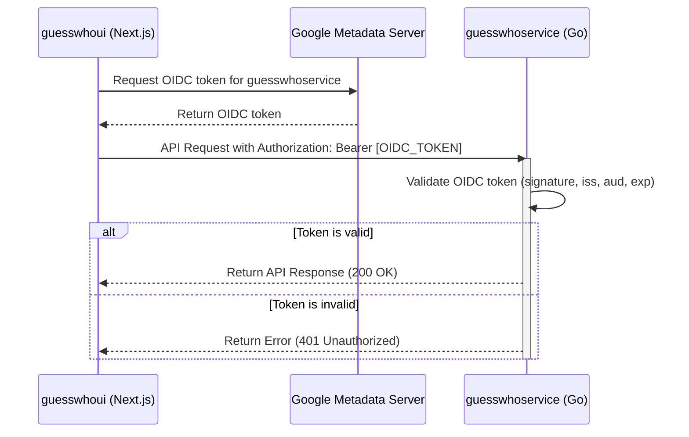

# Service-to-Service Authentication: Technical Design

**Author:** Roo
**Date:** 2026-02-18
**Status:** Proposed

## 1. Introduction

This document outlines the technical design for implementing OIDC-based service-to-service authentication between the `guesswhoui` (Next.js) and `guesswhoservice` (Go) applications. With the deprecation of `guesswhoclient`, its API endpoints are being migrated to `guesswhoservice`, necessitating a robust security mechanism to restrict access to authorized services only.

This design ensures that only the `guesswhoui` service can invoke the protected endpoints now residing in `guesswhoservice`.

## 2. Authentication Flow

The authentication will be based on OIDC identity tokens generated by Google Cloud for the `guesswhoui` service account.

### 2.1. Token Generation and Usage

The flow is as follows:

1.  The `guesswhoui` backend, running on Google Cloud Run, will request an OIDC identity token from the Google metadata server. The audience (`aud`) of this token will be set to the URL of the `guesswhoservice`.
2.  When `guesswhoui` makes an API call to `guesswhoservice`, it will include this OIDC token in the `Authorization` header as a bearer token.
3.  `guesswhoservice` will receive the request, extract the token, and validate it.

### 2.2. Token Validation

The `guesswhoservice` will perform the following validation steps:

1.  **Signature Verification:** Check that the token is signed by a trusted Google certificate authority.
2.  **Issuer Check:** Verify that the `iss` (issuer) claim is `https://accounts.google.com`.
3.  **Audience Check:** Ensure the `aud` (audience) claim matches the URL of the `guesswhoservice`.
4.  **Expiry Check:** Confirm that the token is not expired.
5.  **Identity Check:** Verify that the `email` claim in the token corresponds to the service account of the `guesswhoui` service.

### 2.3. Mermaid Diagram



## 3. Infrastructure Changes (Terraform)

To support this authentication flow, the following changes are required in the Terraform configuration.

### 3.1. `guesswhoui` Service Account

A dedicated service account for the `guesswhoui` Cloud Run service is needed.

**File:** `terraform/modules/guesswhoui/main.tf` (New resource)

```terraform
resource "google_service_account" "guesswhoui_app_sa" {
  account_id   = "guesswhoui-app-sa"
  display_name = "GuessWho UI App Service Account"
}
```

This service account must be assigned to the `guesswhoui` Cloud Run service.

**File:** `terraform/modules/guesswhoui/main.tf` (Modification)

```terraform
resource "google_cloud_run_v2_service" "guesswhoui" {
  name     = "guesswhoui"
  location = "europe-west1"

  template {
    service_account = google_service_account.guesswhoui_app_sa.email # Add this line
    containers {
      image = var.image_url
      env {
        name  = "REDIS_URL"
        value = var.redis_url
      }
    }
  }
...
}
```

### 3.2. IAM Permissions

The `guesswhoui` service account needs permission to invoke the `guesswhoservice`.

**File:** `terraform/modules/guesswhoservice/iam.tf` (New resource)

```terraform
resource "google_cloud_run_v2_service_iam_member" "guesswhoservice_invoker" {
  project  = var.project_id
  location = var.region
  name     = google_cloud_run_v2_service.guesswhoservice.name
  role     = "roles/run.invoker"
  member   = "serviceAccount:${module.guesswhoui.service_account_email}"
}
```

### 3.3. `guesswhoservice` Ingress Control

The `guesswhoservice` must be configured to only allow authenticated internal traffic.

**File:** `terraform/modules/guesswhoservice/main.tf` (Modification)

```terraform
resource "google_cloud_run_v2_service" "guesswhoservice" {
  name     = "guesswhoservice"
  location = var.region
  ingress  = "INGRESS_TRAFFIC_INTERNAL_ONLY" # Add this line

  template {
...
  }
}
```

## 4. Implementation Guidance

### 4.1. `guesswhoui` (Next.js/TypeScript)

To obtain the OIDC token, the `google-auth-library` package is recommended. The token should be fetched on the server-side within Next.js API routes or server components that communicate with `guesswhoservice`.

**File:** `guesswhoui/src/lib/api.ts` (or a new server-side module)

```typescript
import { GoogleAuth } from 'google-auth-library';

async function getOidcToken() {
  const auth = new GoogleAuth();
  const client = await auth.getIdTokenClient(process.env.GUESSWHOSERVICE_URL);
  const token = await client.idTokenProvider.fetchIdToken(process.env.GUESSWHOSERVICE_URL);
  return token;
}

// Example of making an authenticated request
export async function fetchFromGuessWhoService(path: string) {
  const token = await getOidcToken();
  const response = await fetch(`${process.env.GUESSWHOSERVICE_URL}${path}`, {
    headers: {
      'Authorization': `Bearer ${token}`,
    },
  });

  if (!response.ok) {
    throw new Error('Request to guesswhoservice failed');
  }

  return response.json();
}
```

### 4.2. `guesswhoservice` (Go)

For token validation, the `google.golang.org/api/idtoken` package provides a convenient way to validate Google-issued OIDC tokens. A middleware approach is recommended.

**File:** `guesswhoservice/internal/middleware/auth.go` (New file)

```go
package middleware

import (
	"context"
	"net/http"
	"strings"

	"google.golang.org/api/idtoken"
)

func OIDCAuth(audience string) func(http.Handler) http.Handler {
	return func(next http.Handler) http.Handler {
		return http.HandlerFunc(func(w http.ResponseWriter, r *http.Request) {
			authHeader := r.Header.Get("Authorization")
			if authHeader == "" {
				http.Error(w, "Authorization header required", http.StatusUnauthorized)
				return
			}

			parts := strings.Split(authHeader, " ")
			if len(parts) != 2 || parts[0] != "Bearer" {
				http.Error(w, "Invalid Authorization header format", http.StatusUnauthorized)
				return
			}
			tokenString := parts[1]

			payload, err := idtoken.Validate(context.Background(), tokenString, audience)
			if err != nil {
				http.Error(w, "Invalid token: "+err.Error(), http.StatusUnauthorized)
				return
			}

			// Optionally, you can add the validated claims to the request context
			// for use in downstream handlers.
			// ctx := context.WithValue(r.Context(), "userClaims", payload.Claims)
			// next.ServeHTTP(w, r.WithContext(ctx))

			next.ServeHTTP(w, r)
		})
	}
}
```

This middleware can then be applied to the routes that require service-to-service authentication.